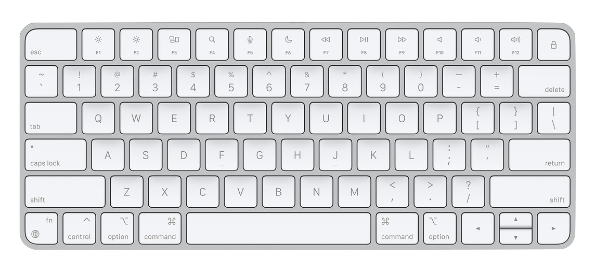

<hgroup markdown="1">
# Unsuck your typography: 10 tips anyone can use to create a better reading experience

We come across lots of bad typography in our everyday lives, usually created by everyday people who aren’t trained designers. But it doesn’t have to be this way.
</hgroup>

<figure>
  
  <figcaption>Apple Magic Keyboard - US English</figcaption>
</figure>

---

These are the ten tips at a glance. You can follow these using most text editors you’ll come across, whether you’re editing a document, a presentation, a flyer, or a website. Read on for further explanation of each one. Technical terms are in *italics*.

1. Don’t use more than two fonts per project
1. Don’t combine similar fonts
1. Don’t use script fonts
1. Don’t use low-quality fonts
1. Don’t make body text too small
1. Don’t make body text too wide
1. Don’t make the space between lines of text too much or too little
1. Don’t place text on backgrounds of similar lightness or darkness
1. Don’t place text directly on busy image backgrounds
1. Don’t forget to use proper typographic symbols

## 1. Don’t use more than two fonts per project

Limiting your palette to one or two *typefaces* helps a work feel more cohesive and consistent. For variety, instead of adding another typeface, use the provided variations such as *weight* (bold, semibold) and italics. But don’t overdo it.

## 2. Don’t combine similar fonts

If you use more than one font on a project, choose fonts that complement each other but are distinctly different. A common practice is to pair a *serif font* (like Georgia) with a *sans-serif font* (like Verdana), using one for headings and one for body text.

## 3. Don’t use script fonts

Most script fonts are very hard to read, especially for people with vision difficulties. Use other graphic elements to provide visual flourishes and keep the text readable. Unless it’s a wedding invitation, script fonts are almost never a good choice.

## 4. Don’t use low-quality fonts

The breakthrough of the Macintosh was including high-quality typefaces in the operating system. Today, there are great options on [Google Fonts](https://fonts.google.com/) (tip: sort by Most Popular). Avoid web searches that take you to “thousands of free fonts” websites. Most of these are not as well built as what’s on your computer or Google Fonts.

## 5. Don’t make body text too small

For the main text you want people to read, start with a comfortable size and then choose heading sizes relative to that. Defaults don’t help because document editor defaults are usually based on old print conventions. With more people reading on high-resolution digital screens, start with bumping the size up a notch or two and compare it to something else that looks good on the same screen.

## 6. Don’t make body text too wide

There should be a direct relationship between the font size and the length of a line text. It doesn’t have to be mathematically precise, but in general, smaller text should have shorter *line lengths*. For body text, a good rule of thumb is to keep it between 2 to 3 alphabets. This is more of an issue on larger screens like laptops and desktops.

## 7. Don’t make the space between lines of text too much or too little

Just like the line length, the space between lines should relate to the font size too. When the *line spacing* is too much or too little, it’s harder to read. Here again, defaults don’t help. Most body text will feel right with line spacing between 120% and 140% of the font size. Use a multiple setting (like 1.35) if the editor allows, or multiply by the font size manually. (For example, 12 x 1.35 is about 16.)

## 8. Don’t place text on backgrounds of similar lightness or darkness

Ensuring there is enough contrast between the text color in the foreground and the color of the background is critical to legibility. Light text should be placed on dark backgrounds and vice versa. Even professionals make this mistake when, for example, the yellow of a sports team’s colors is used behind white text. If you’re unsure, use a [contrast checker](https://coolors.co/contrast-checker) and aim for a 4.5-to-1 contrast ratio.

## 9. Don’t place text directly on busy image backgrounds

Placing text over images can be challenging because of the variation in contrast that occurs with the image content. Instead of one foreground and background combination to worry about, you have many. To avoid this, use another element between the text and the image (like a translucent shape) or text effects (like a drop shadow or an outline) for better clarity.

## 10. Don’t forget to use proper typographic symbols

One of the most subtle but effective ways to elevate your typography is to use proper typographic symbols for characters like apostrophes, quotes, ellipses, dashes, and [more](https://practicaltypography.com/type-composition.html). Don’t settle for conventions established when we used typewriters. Some document editors may take care of some of these for you, but double check yourself, especially if you’re moving text between editors.

---

Made with 🤖 on [GitHub](https://github.com/pglevy/unsuck-your-typography#readme)